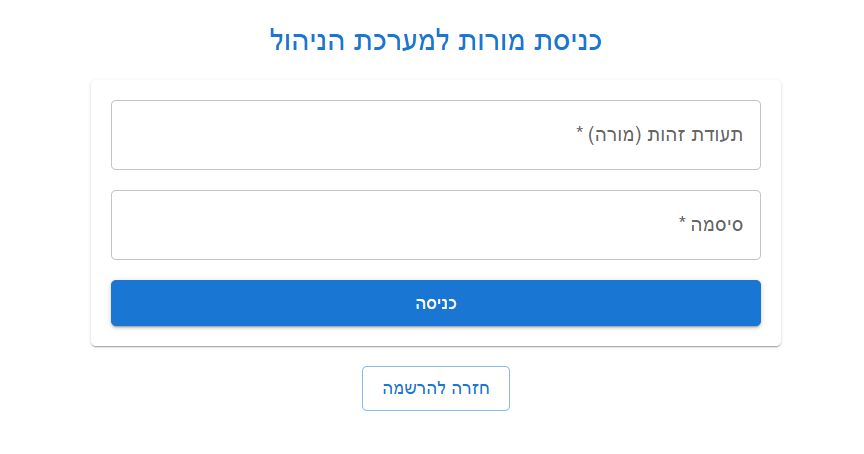
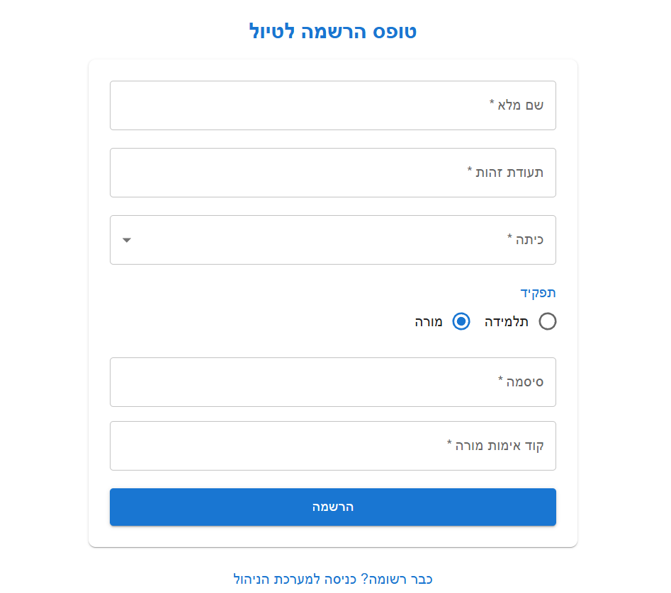
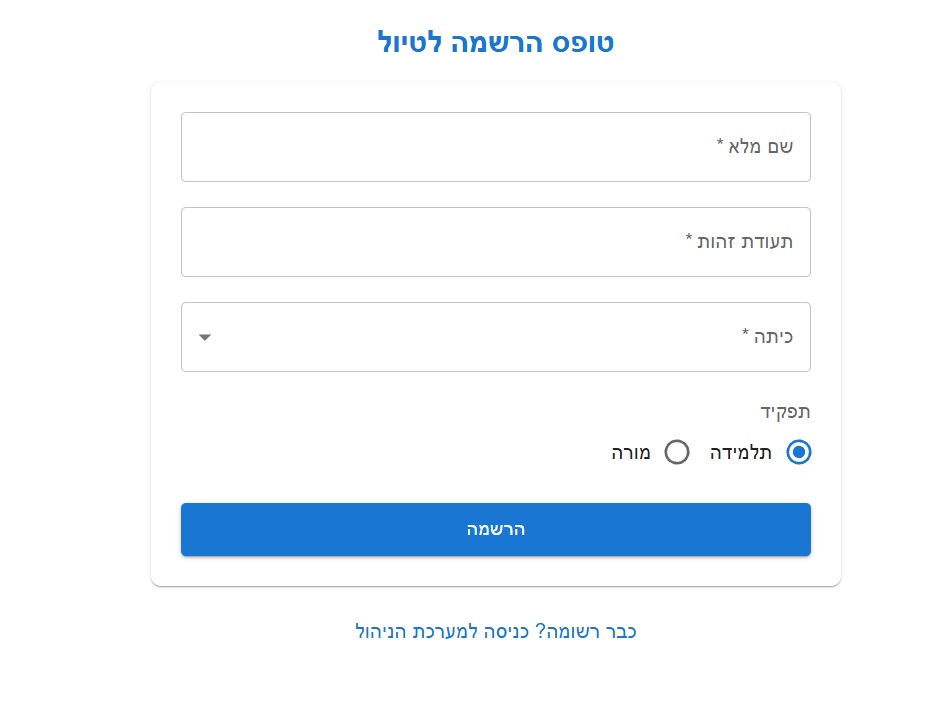
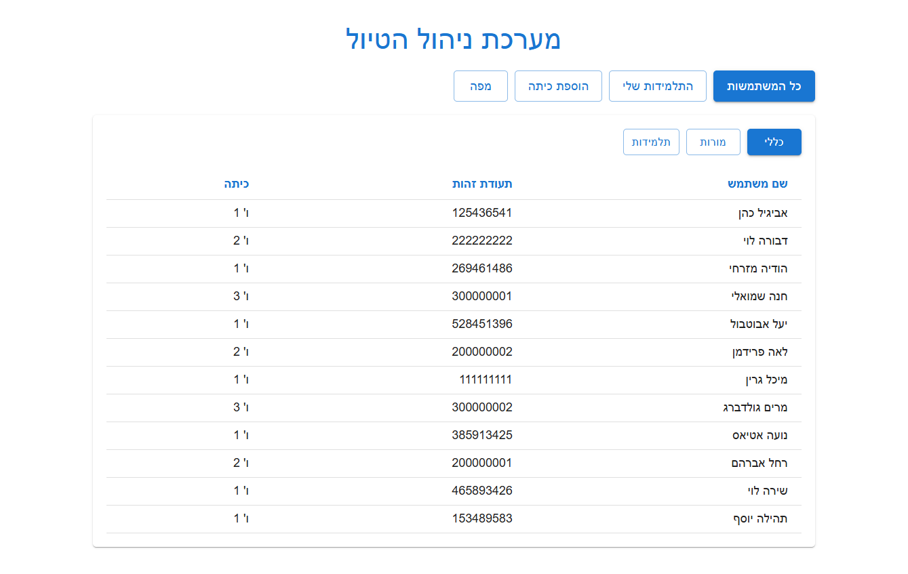
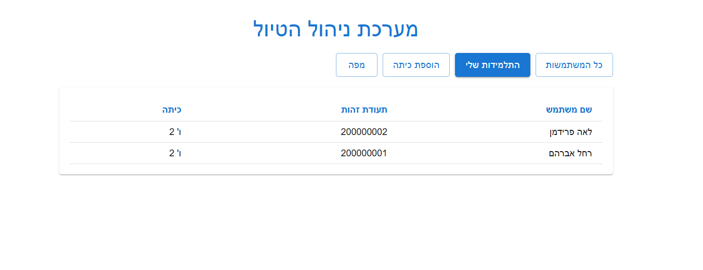
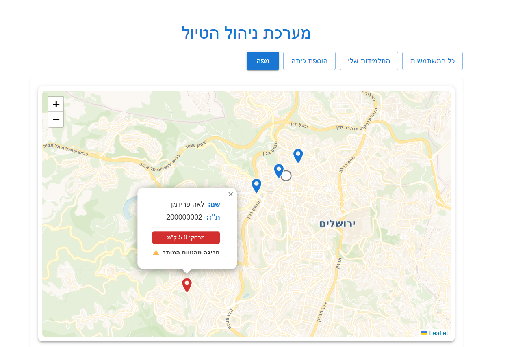

# מערכת ניהול טיול ומעקב מיקומים

## סקירה כללית
פרויקט Full-Stack לניהול טיול בית-ספרי.  
המערכת מאפשרת למורה להתחבר, לצפות במשתמשות, לראות את התלמידות מהכיתה שלה, להוסיף כיתות, ולצפות במיקומים על מפה.

המיקומים נשלחים לשרת דרך נקודת קצה ייעודית למכשיר, ומוצגים למורה במפה עם רענון אוטומטי.

---

## טכנולוגיות

### צד לקוח (Client)
- React + Vite
- Material UI
- React Router
- Leaflet + React-Leaflet

### צד שרת (Server)
- Node.js
- Express
- MySQL (`mysql2`)
- JWT
- bcrypt
- dotenv

## מבנה תיקיות בפרויקט
```text
Hadasim-Trip-Management/
├── client/
├── server/
├── docs/
│   └── images/
└── README.md
```

---

## יכולות עיקריות

### 1) אימות והרשאות
- הרשמה של משתמשת (`student`/`teacher`)
- התחברות למערכת: **מורה בלבד**
- JWT לשמירת סשן
- בדיקת הרשאות לפי תפקיד באמצעות Middleware
-סיסמאות נשמרות כ־Hash באמצעות bcrypt 

### 2) דשבורד מורה
- צפייה בכל המשתמשות
- סינון לפי תפקיד
- צפייה ב"תלמידות שלי" לפי הכיתה של המורה
- הוספת כיתה חדשה

### 3) מפת מיקומים - עם הרשאת מורה בלבד
- הצגת מיקום המורה ומיקומי תלמידות על מפה
- רענון נתונים כל 60 שניות
- סימון תלמידות רחוקות מ־3 ק"מ בצבע שונה + חיווי חריגה

### 4) קליטת מיקום ממכשיר
- endpoint ייעודי: `POST /api/locations/update`
- אימות באמצעות `x-api-key`
- המרה מפורמט קואורדינטות שמגיע מהמכשיר לקואורדינטות עשרוניות
- שמירת המיקום האחרון לכל משתמשת (upsert)

---

## מבנה בסיס נתונים
הסכמה נמצאת בקובץ: `server/database/schema.sql`

טבלאות:
- `Classes` – כיתות
- `Users` – משתמשות (מורות/תלמידות)
- `Locations` – מיקום עדכני לפי `user_id`

---

## API Endpoints

### Users
- `POST /api/users/register`
- `POST /api/users/login`
- `GET /api/users` (teacher בלבד)
- `GET /api/users/my-students` (teacher בלבד)

### Classes
- `GET /api/classes`
- `POST /api/classes` (teacher בלבד)

### Locations
- `POST /api/locations/update` (עם `x-api-key`)
- `GET /api/locations/all` (teacher בלבד)

---

## הרצה מקומית

### 1. בסיס נתונים
1. יצירת מסד נתונים בשם `hadasim_trip`
2. הרצה של `server/database/schema.sql`

### 2. הרצת שרת

cd server
npm install
npm run dev

### 3. הרצת לקוח

cd client
npm install
npm run dev

## משתני סביבה

### `server/.env`
- `DB_HOST`
- `DB_USER`
- `DB_PASSWORD`
- `DB_NAME` (ברירת מחדל: `hadasim_trip`)
- `JWT_SECRET`
- `JWT_EXPIRES` (לדוגמה: `1h`)
- `TEACHER_SECRET_CODE`
- `DEVICE_SECRET_KEY`
- `PORT` (ברירת מחדל: `5000`)

### `client/.env`
- `VITE_API_URL` (ברירת מחדל: `http://localhost:5000`)

#הנחות מקלות
המערכת מיועדת לסביבת פיתוח מקומית.
קליטת מיקומים תלויה בשליחת x-api-key תקין.
נשמר מיקום עדכני לכל משתמשת (ולא היסטוריית מסלול מלאה).
קיימת תמיכה בשני תפקידים בלבד: teacher, student.
נתונים שהוכנסו נכונים

# צילומי מסך

### התחברות


### הרשמת מורה


### הרשמת תלמידה


###הצגת כל המשתמשות


###  הצגת התלמידות שלי


### תצוגת מפה

